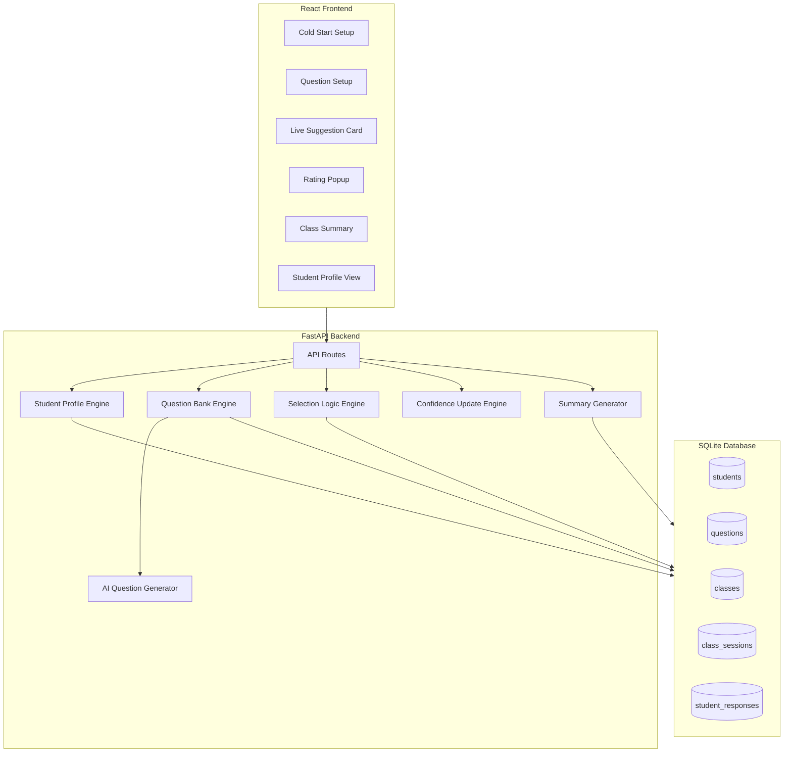
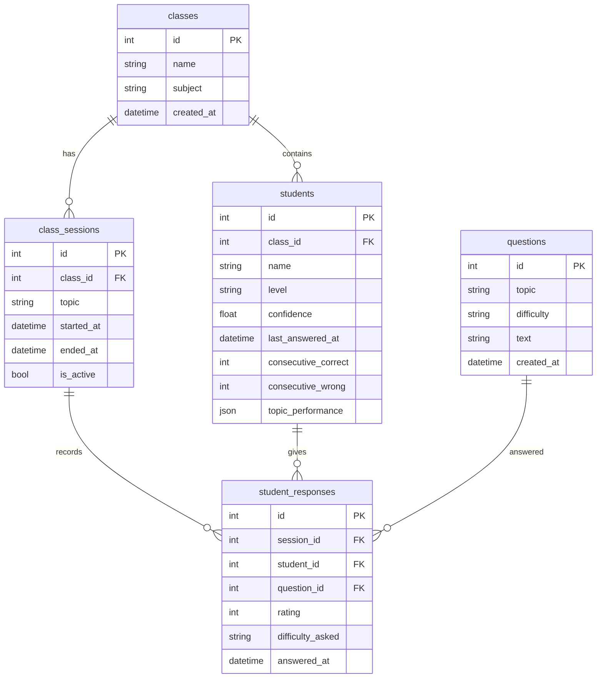

# Sahayak Pro - Implementation Plan

## Architecture Overview



## Project Structure

```
feedback_system/
├── backend/
│   ├── main.py                 # FastAPI app entry
│   ├── database.py             # SQLite connection + models
│   ├── models.py               # Pydantic schemas
│   ├── routers/
│   │   ├── students.py         # Student CRUD
│   │   ├── classes.py          # Class management
│   │   ├── questions.py        # Question bank + AI generation
│   │   ├── sessions.py         # Live class session
│   │   └── analytics.py        # Summary endpoints
│   ├── engines/
│   │   ├── selection.py        # Student selection logic
│   │   ├── confidence.py       # Confidence update logic
│   │   └── ai_questions.py     # LLM question generation
│   └── requirements.txt
├── frontend/
│   ├── src/
│   │   ├── components/
│   │   │   ├── StudentCard.jsx
│   │   │   ├── SuggestionCard.jsx
│   │   │   ├── RatingPopup.jsx
│   │   │   └── StarRating.jsx
│   │   ├── pages/
│   │   │   ├── ColdStartSetup.jsx
│   │   │   ├── QuestionSetup.jsx
│   │   │   ├── LiveSession.jsx
│   │   │   ├── ClassSummary.jsx
│   │   │   └── StudentProfile.jsx
│   │   ├── api/
│   │   │   └── client.js       # API calls
│   │   ├── App.jsx
│   │   └── main.jsx
│   ├── package.json
│   └── index.html
└── README.md
```

## Database Schema



## Implementation Phases

### Phase 1: Backend Foundation

- Set up FastAPI with SQLite using SQLAlchemy
- Create database models for students, classes, questions, sessions, responses
- Implement basic CRUD endpoints for students and classes
- Add Pydantic schemas for request/response validation

### Phase 2: Core Engines

- **Selection Logic Engine**: Priority scoring algorithm
  ```python
  priority_score = (
      (5 - confidence) * 3 +           # Low confidence boost
      days_since_last_answer * 2 +      # Time penalty
      weak_topic_bonus -                 # Topic weakness
      just_answered_penalty              # Recent answer penalty
  )
  ```

- **Confidence Update Engine**: Rating to confidence delta mapping
- **AI Question Generator**: Integration with OpenAI/Anthropic API for topic-based question generation

### Phase 3: React Frontend Setup

- Initialize React project with Vite
- Set up routing (React Router)
- Create API client with fetch/axios
- Design system with CSS variables for consistent styling

### Phase 4: Screen Implementation

**Screen 1 - Cold Start Setup**

- Add class form
- Bulk student entry with initial rating (1-5 stars or Weak/Medium/Strong)
- Import from CSV option

**Screen 2 - Question Setup**

- Topic selection
- AI-generate questions button
- Easy/Medium/Hard categorized list
- Edit/Add/Remove functionality
- "Start Class" button

**Screen 3 - Live Suggestion Card (Core)**

- Single prominent card showing:
  - Student name + avatar
  - Difficulty badge
  - Suggested question text
  - Reason tooltip
- "Ask" and "Skip" buttons
- Progress indicator

**Screen 4 - Rating Popup**

- 5-star interactive rating
- Quick notes field (optional)
- Submit triggers next suggestion

**Screen 5 - Class Summary**

- Participation percentage chart
- Students who improved list
- Students skipped/not called
- Difficulty distribution
- Session duration

**Screen 6 - Student Profile**

- Confidence trend chart
- Level progression
- Topic performance breakdown
- Answer history

### Phase 5: Integration and Polish

- Connect all frontend screens to backend APIs
- Add loading states and error handling
- Implement session persistence
- Add keyboard shortcuts for fast rating

## Key API Endpoints

| Method | Endpoint | Description |

|--------|----------|-------------|

| POST | `/api/classes` | Create new class |

| POST | `/api/classes/{id}/students` | Add students to class |

| POST | `/api/questions/generate` | AI-generate questions for topic |

| POST | `/api/sessions/start` | Start live class session |

| GET | `/api/sessions/{id}/next` | Get next student suggestion |

| POST | `/api/sessions/{id}/respond` | Submit rating for response |

| GET | `/api/sessions/{id}/summary` | Get class summary |

| GET | `/api/students/{id}/profile` | Get student profile |

## UI Design Direction

- **Color Palette**: Warm, approachable colors (soft greens, yellows) suitable for education
- **Typography**: Clear, readable fonts (system fonts for performance)
- **Cards**: Large touch-friendly buttons for classroom use
- **Animations**: Subtle card transitions for suggestion flow